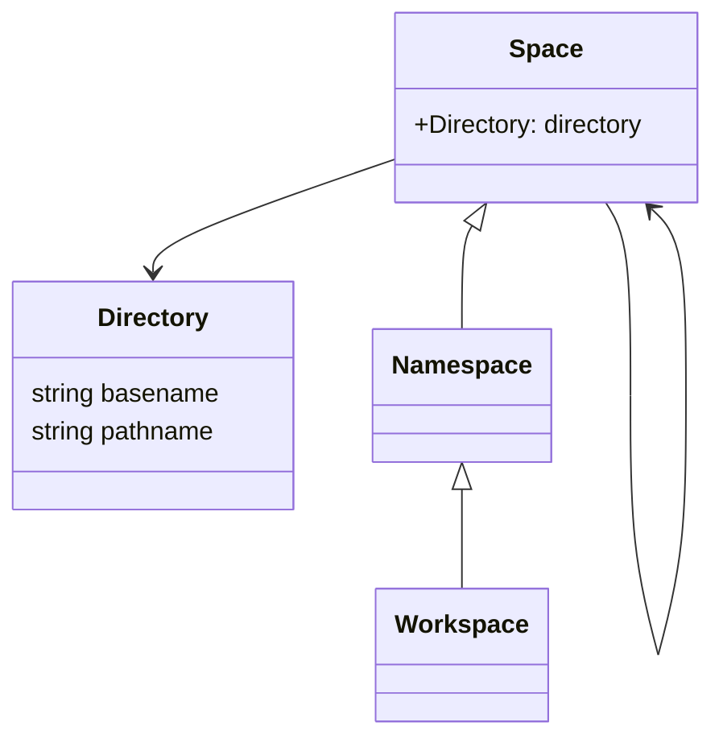

- 最小单元是 Document

  - 必须实现在一个 Directory 中
  - 必须有且只有一个 `README.md` 文件
    - 可选的使用 yaml-front-matter
    - 正文段落为任意内容
  - 目录可以包含其他 File / Directory（不含 `README.md`）
  - 所有的 Document 组成 DocumentTree
  - 确保底层存储的通用完整性

- 基于 DocumentTree 生成 SpaceTree

  - 由 Workspace 和 Namespace 组成
  - Namespace 可以同时包含 StaticScope 和 InstanceScope 两部分
    - 由 Workspace 的 Schema 机制决定
    - StaticScope 是 Namespace 自身作为一个独立实例的抽象
    - InstanceScope 是 Namespace 作为 Constructor / Class 的概念抽象
      - 一个 Instance 由 General / I18n 两个域概念组合定义
        - 所有实例由 UUID 标识
        - General 相关定义是共用的
        - I18n 相关定义需要对应 language，即一个 Instance 的 I18n 数据和文档有多份
  - Workspace 是一个 SpaceTree 的唯一的且是 root
    - 包含特殊 Document
      - `.mdsrc/**`，元数据
        - 包含 language 的 definition
        - 包含 definition 的 definition（可能只是完整性表达）
        - 有关 mds 的版本信息和其他属性
      - `language/*/README.md`，支持 i18n 有关语言的定义
        - 是 Language Instance
        - 可以自定义 lang-code 或套用标准
      - `definition/**`，与实际存储结构对应平行，定义结构的目录
        - 同样可以表示为一个 DocumentTree
        - 不包含 I18n 特性
        - 可以使用文档区作为注释信息
        - 每一个 Definition 使用 json-schema 标准的 yaml-schema 变体进行定义
      - `document/**`, 按照 definition 要求，维护数据的目录

- 生成制品
  - `data.d.ts`
  - `data.json`
  - `html/**`
  - 可以基于 Workspace 扩展
